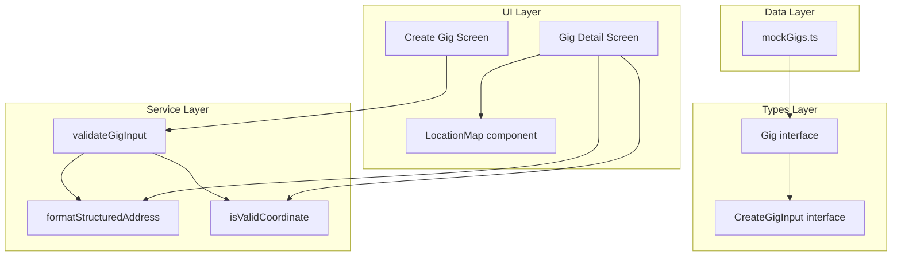

# Design Document: Address Granularity & Map Pin

## Overview

This feature replaces the single free-text `address` field on the `Gig` model with structured address components (addressLine1, addressLine2, city, postcode, country) and adds a static map pin to the gig detail screen. The changes touch the type layer, validation service, create form, detail display, and mock data.

The design follows existing patterns in the codebase: pure service functions for validation, `react-native-maps` for map rendering (already used in the Explore tab), and `StyleSheet.create()` for styling.

### Key Design Decisions

1. **Address formatting as a pure utility function** — Extracting the comma-separated display logic into a standalone function in `gigService.ts` makes it testable independent of React rendering. This matches the existing pattern of pure functions (`formatPay`, `truncateTitle`) in that module.

2. **Coordinate validation as a predicate function** — A pure `isValidCoordinate(lat, lng)` function determines whether the map renders. This keeps the display logic simple (conditional render) and the validation testable.

3. **Reuse of `react-native-maps`** — The Explore tab already imports and configures `react-native-maps`. The detail screen map is a simpler, non-interactive variant using the same `MapView` and `Marker` components.

4. **No breaking change to `Gig.latitude`/`longitude`** — The existing numeric coordinate fields are retained unchanged. The new map pin feature consumes them directly.

## Architecture



### Data Flow

1. **Create path**: Hoster fills structured address fields → form state → `validateGigInput()` checks required/max-length → `createGig()` persists with new fields
2. **Display path**: `getGigById()` returns gig → `formatStructuredAddress()` produces display string → `isValidCoordinate()` gates map rendering → `LocationMap` renders pin

## Components and Interfaces

### New Pure Functions (`src/data/gigService.ts`)

#### `formatStructuredAddress`

```typescript
interface StructuredAddress {
  addressLine1: string;
  addressLine2?: string;
  city: string;
  postcode: string;
  country: string;
}

/**
 * Formats structured address fields into a single comma-separated display string.
 * Omits empty/undefined fields and their separators — no double commas or trailing commas.
 */
function formatStructuredAddress(address: StructuredAddress): string;
```

#### `isValidCoordinate`

```typescript
/**
 * Returns true if lat/lng represent a valid, non-zero geographic coordinate.
 * Valid: latitude in [-90, 90], longitude in [-180, 180], both non-zero.
 */
function isValidCoordinate(latitude: number, longitude: number): boolean;
```

### New UI Component (`src/components/LocationMap.tsx`)

```typescript
interface LocationMapProps {
  latitude: number;
  longitude: number;
}

/**
 * Non-interactive MapView with a single marker pin.
 * Fixed height 200pt, full width, zoom level ~0.01 delta.
 * Disables all user interaction (scroll, zoom, rotate).
 */
function LocationMap({ latitude, longitude }: LocationMapProps): JSX.Element;
```

### Modified Components

| Component | Change |
|-----------|--------|
| `src/types/index.ts` | Replace `address: string` with structured fields on `Gig` and `CreateGigInput` |
| `src/data/gigService.ts` | Update `validateGigInput` to check new address fields; add `formatStructuredAddress` and `isValidCoordinate` |
| `src/app/gig/create.tsx` | Replace single address input with 5 fields; wire up per-field validation errors |
| `src/app/gig/[id].tsx` | Use `formatStructuredAddress` for display; conditionally render `LocationMap` |
| `src/data/mockGigs.ts` | Migrate address strings to structured fields |
| `src/components/GigCard.tsx` | Update address display (may use `formatStructuredAddress` or show city only) |

## Data Models

### Updated `Gig` Interface

```typescript
export interface Gig {
  id: string;
  title: string;
  venueName: string;
  // Replaces: address: string
  addressLine1: string;       // max 100 chars, required
  addressLine2?: string;      // max 100 chars, optional
  city: string;               // max 50 chars, required
  postcode: string;           // max 15 chars, required
  country: string;            // max 60 chars, required
  latitude: number;
  longitude: number;
  date: string;
  startTime: string;
  endTime: string;
  genre: Genre;
  pay: number;
  description: string;
  status: GigStatus;
  hosterId: string;
  acceptedMusicianIds: string[];
}
```

### Updated `CreateGigInput` Interface

```typescript
export interface CreateGigInput {
  title: string;
  venueName: string;
  // Replaces: address: string
  addressLine1: string;
  addressLine2?: string;
  city: string;
  postcode: string;
  country: string;
  date: string;
  startTime: string;
  endTime: string;
  genre: Genre;
  pay: number;
  description?: string;
}
```

### Field Constraints

| Field | Max Length | Required |
|-------|-----------|----------|
| addressLine1 | 100 | Yes |
| addressLine2 | 100 | No |
| city | 50 | Yes |
| postcode | 15 | Yes |
| country | 60 | Yes |

## Correctness Properties

*A property is a characteristic or behavior that should hold true across all valid executions of a system — essentially, a formal statement about what the system should do. Properties serve as the bridge between human-readable specifications and machine-verifiable correctness guarantees.*

### Property 1: Address field max-length validation

*For any* structured address field (addressLine1, addressLine2, city, postcode, country) and *for any* string whose length exceeds that field's defined maximum, the validation service SHALL return a validation error identifying that specific field.

**Validates: Requirements 1.1, 1.2, 1.3, 1.4, 1.5, 2.5**

### Property 2: Required address field validation

*For any* CreateGigInput where one or more required address fields (addressLine1, city, postcode, country) are empty or whitespace-only, the validation service SHALL return a validation error for exactly those empty required fields and no others.

**Validates: Requirements 2.4, 5.4**

### Property 3: Address formatting with optional field omission

*For any* structured address object, the formatted output string SHALL contain exactly the non-empty fields in the order (addressLine1, addressLine2, city, postcode, country), each separated by a comma and space, with no leading separator, no trailing separator, and no consecutive separators.

**Validates: Requirements 3.1, 3.2, 3.3**

### Property 4: Coordinate validity determines map visibility

*For any* pair of numbers (latitude, longitude), `isValidCoordinate` SHALL return true if and only if latitude is in the range [-90, 90] AND longitude is in the range [-180, 180] AND neither value is exactly zero.

**Validates: Requirements 4.6**

## Error Handling

### Validation Errors

The existing `ValidationError` type (`{ type: 'validation'; fields: Record<string, string> }`) is reused. New field keys added:

| Key | Error Condition | Message |
|-----|----------------|---------|
| `addressLine1` | Empty/whitespace | "This field is required" |
| `addressLine1` | >100 chars | "Address Line 1 must be 100 characters or fewer" |
| `addressLine2` | >100 chars | "Address Line 2 must be 100 characters or fewer" |
| `city` | Empty/whitespace | "This field is required" |
| `city` | >50 chars | "City must be 50 characters or fewer" |
| `postcode` | Empty/whitespace | "This field is required" |
| `postcode` | >15 chars | "Postcode must be 15 characters or fewer" |
| `country` | Empty/whitespace | "This field is required" |
| `country` | >60 chars | "Country must be 60 characters or fewer" |

### Map Rendering Failures

- Invalid coordinates (zero, out of range, NaN): Map is hidden entirely — no error message shown to the user. This is a graceful degradation, not an error state.
- `react-native-maps` crash: The existing `ErrorBoundary` pattern from the Explore tab is not needed here since the map is non-interactive and small. If the native map fails to render, React Native will show nothing in that slot, which is acceptable.

## Testing Strategy

### Property-Based Tests (fast-check)

The project already has `fast-check ^4.8.0` installed. Each correctness property maps to a property-based test with ≥100 iterations.

| Property | Test File | What's Generated |
|----------|-----------|-----------------|
| 1: Max-length validation | `src/__tests__/data/addressValidation.property.test.ts` | Random strings of length > max for each field |
| 2: Required field validation | `src/__tests__/data/addressValidation.property.test.ts` | Random subsets of empty required fields |
| 3: Address formatting | `src/__tests__/data/formatAddress.property.test.ts` | Random StructuredAddress objects with optional empty fields |
| 4: Coordinate validity | `src/__tests__/data/coordinateValidation.property.test.ts` | Random lat/lng pairs spanning valid, invalid, and boundary values |

Configuration:
- Minimum 100 iterations per property (`numRuns: 100`)
- Each test tagged with: `Feature: address-granularity-map-pin, Property {N}: {title}`

### Unit Tests (example-based)

| Area | Test File | Coverage |
|------|-----------|----------|
| Create Gig form rendering | `src/__tests__/components/CreateGigForm.test.tsx` | 5 address inputs present, required indicators, optional label |
| Gig Detail address display | `src/__tests__/components/GigDetail.test.tsx` | Formatted address renders, map visible/hidden |
| LocationMap component | `src/__tests__/components/LocationMap.test.tsx` | Props passed correctly, non-interactive flags set |
| Mock data structure | `src/__tests__/data/mockGigs.test.ts` | All entries have structured fields, no `address` field |

### Test Balance

- **Property tests** handle the pure logic (validation rules, formatting, coordinate checks) across wide input spaces
- **Unit tests** handle UI rendering concerns (correct components mounted, props passed, layout order) with specific examples
- Together they provide full coverage without over-testing either layer
