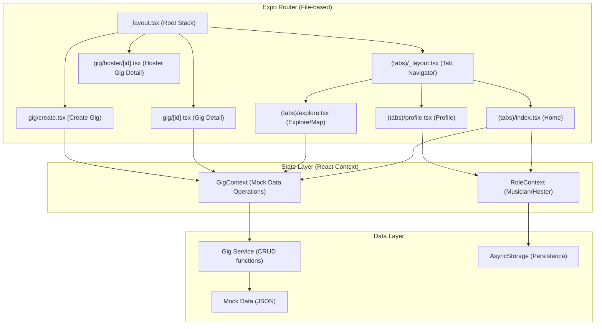

# Design Document: Initial Build

## Overview

This design establishes the foundational architecture for Transient — a cross-platform gig marketplace connecting musicians with hosters. The initial build delivers: tab-based navigation, role-based dashboards with gig carousels, a map view, gig detail/creation screens, role switching with persistence, and a local mock data layer.

The architecture prioritizes:
- **Simplicity**: React Context for state at this scale (no Redux/Zustand overhead)
- **Convention**: Expo Router file-based routing with `_layout.tsx` patterns
- **Cross-platform parity**: Shared components with platform-specific map implementations
- **Testability**: Pure data functions separated from UI for property-based testing

## Architecture

### High-Level Architecture



### Design Decisions

| Decision | Choice | Rationale |
|----------|--------|-----------|
| State management | React Context + useReducer | App-scale state is small (role, gig list, recently viewed). No need for external libraries yet. Easy to swap for Zustand/Redux later if needed. |
| Navigation | Expo Router Tabs + Stack | File-based routing is already configured. Tab layout handles bottom nav natively. Stack handles modal/detail screens. |
| Maps (mobile) | react-native-maps | De facto standard for RN maps. Supports MapKit (iOS) and Google Maps (Android). |
| Maps (web) | react-native-web-maps or static fallback | react-native-maps doesn't support web. Use a lightweight Leaflet wrapper or show a list fallback with a "maps unavailable on web" message. |
| Persistence | @react-native-async-storage/async-storage | Lightweight key-value store for role preference and recently viewed. Works across all platforms. |
| Form handling | Controlled components + custom validation | No heavy form library needed for a single form. Keep it simple with inline validation logic. |
| Theme | Existing Colors/Fonts/Spacing constants + useColorScheme | Already defined in theme.ts. Use React Native's `useColorScheme()` hook to detect system preference. |

### Folder Structure (New Files)

```
src/
├── app/
│   ├── _layout.tsx                  # Root Stack layout (wraps with providers)
│   ├── (tabs)/
│   │   ├── _layout.tsx             # Tab navigator layout
│   │   ├── index.tsx               # Home (Dashboard)
│   │   ├── explore.tsx             # Map view
│   │   └── profile.tsx             # Profile + Role Switcher
│   ├── gig/
│   │   ├── [id].tsx                # Musician gig detail
│   │   ├── create.tsx              # Hoster create gig form
│   │   └── hoster/
│   │       └── [id].tsx            # Hoster gig detail (with accepted musicians)
├── components/
│   ├── GigCard.tsx                  # Reusable gig card (musician + hoster variants)
│   ├── Carousel.tsx                 # Horizontal scrolling carousel
│   ├── EmptyState.tsx              # Empty section placeholder
│   ├── MapView.tsx                  # Platform-adaptive map wrapper
│   ├── MapView.web.tsx             # Web-specific map implementation
│   ├── GigMarkerPopup.tsx          # Map marker summary popup
│   ├── RoleSwitcher.tsx            # Toggle component for role switching
│   ├── ConfirmationBanner.tsx      # Timed confirmation message
│   └── ThemedView.tsx              # View wrapper applying theme colors
├── constants/
│   └── theme.ts                    # Copied from example/src/constants/theme.ts
├── context/
│   ├── RoleContext.tsx             # Role state + persistence
│   └── GigContext.tsx              # Gig data state + operations
├── data/
│   ├── mockGigs.ts                 # Sample gig data (10+ gigs)
│   ├── mockProfiles.ts            # Sample musician/hoster profiles
│   └── gigService.ts              # CRUD functions over mock data
├── hooks/
│   ├── useThemeColor.ts           # Returns themed color value
│   └── useColorScheme.ts          # System color scheme detection
└── types/
    └── index.ts                    # Shared TypeScript interfaces
```

## Components and Interfaces

### Screen Components

#### `(tabs)/_layout.tsx` — Tab Navigator
Configures the bottom tab bar with three tabs: Home, Explore, Profile. Uses themed colors for active/inactive states. Icons sourced from `expo-symbols` or inline SVG.

#### `(tabs)/index.tsx` — Dashboard (Home)
Reads the current role from `RoleContext`. Renders musician carousels (Latest, Recently Viewed, Accepted) or hoster carousels (Active Gigs, Past Gigs) + Create Gig button accordingly.

#### `(tabs)/explore.tsx` — Map View
Renders `MapView` component with gig markers. On marker tap, shows `GigMarkerPopup`. On popup tap, navigates to gig detail.

#### `(tabs)/profile.tsx` — Profile + Role Switcher
Displays current user info and the `RoleSwitcher` toggle.

#### `gig/[id].tsx` — Musician Gig Detail
Fetches gig by ID from context. Shows full details. Adds to recently viewed on mount. Shows Accept button or Accepted indicator based on gig status.

#### `gig/create.tsx` — Create Gig Form (Hoster)
Form with controlled inputs, inline validation, date/time pickers. On valid submit, calls `createGig` from `GigContext`, shows confirmation, and navigates back.

#### `gig/hoster/[id].tsx` — Hoster Gig Detail
Shows full gig info plus a list of musicians who accepted.

### Shared Components

#### `Carousel`
```typescript
interface CarouselProps {
  title: string;
  data: Gig[];
  renderItem: (gig: Gig) => React.ReactNode;
  emptyMessage: string;
}
```
Horizontal `FlatList` with section title. Shows `EmptyState` when data is empty.

#### `GigCard`
```typescript
interface GigCardProps {
  gig: Gig;
  variant: 'musician' | 'hoster';
  onPress: (gigId: string) => void;
}
```
- **Musician variant**: title (truncated 40 chars), venue, date (short format), pay (currency)
- **Hoster variant**: title, date, accepted musician count

Uses `backgroundElement` token for card border/elevation.

#### `MapView` / `MapView.web.tsx`
Platform-split component using `.web.tsx` extension for web-specific implementation.
- **Mobile**: Wraps `react-native-maps` `<MapView>` with markers
- **Web**: Shows fallback message or uses `react-leaflet` if installed

```typescript
interface MapViewProps {
  gigs: Gig[];
  initialRegion: MapRegion;
  onMarkerPress: (gig: Gig) => void;
  onPopupPress: (gigId: string) => void;
}
```

#### `RoleSwitcher`
```typescript
interface RoleSwitcherProps {
  currentRole: UserRole;
  onSwitch: () => void;
}
```
Displays current role label with a toggle/button to switch.

#### `ConfirmationBanner`
```typescript
interface ConfirmationBannerProps {
  message: string;
  durationMs?: number; // defaults to 3000
  onDismiss?: () => void;
}
```
Slides in from top, auto-dismisses after duration.

### Context Providers

#### `RoleContext`
```typescript
interface RoleContextValue {
  role: UserRole;
  switchRole: () => void;
  isLoading: boolean; // true while reading persisted role
}
```
On mount, reads role from AsyncStorage. On switch, persists new role and navigates to Home.

#### `GigContext`
```typescript
interface GigContextValue {
  gigs: Gig[];
  recentlyViewed: Gig[];
  acceptedGigs: Gig[];
  getGigById: (id: string) => Gig | null;
  getGigsByStatus: (status: GigStatus) => Gig[];
  createGig: (input: CreateGigInput) => Gig | ValidationError;
  acceptGig: (gigId: string) => void;
  addToRecentlyViewed: (gigId: string) => void;
  getHosterGigs: (hosterId: string) => { active: Gig[]; past: Gig[] };
}
```

### Service Layer

#### `gigService.ts`
Pure functions operating on gig arrays:

```typescript
function getAllGigs(gigs: Gig[]): Gig[];
function getGigById(gigs: Gig[], id: string): Gig | null;
function createGig(gigs: Gig[], input: CreateGigInput): { gig: Gig } | { error: ValidationError };
function updateGig(gigs: Gig[], id: string, updates: Partial<Gig>): Gig | null;
function filterByStatus(gigs: Gig[], status: GigStatus): Gig[];
function addToRecentlyViewed(list: string[], gigId: string, max: number): string[];
function validateGigInput(input: Partial<CreateGigInput>): ValidationError | null;
function formatPay(amount: number): string;
function truncateTitle(title: string, max: number): string;
```

These are intentionally separated from state/context so they can be tested in isolation.

## Data Models

### Core Types

```typescript
type UserRole = 'musician' | 'hoster';

type GigStatus = 'available' | 'accepted' | 'past';

type Genre = 'rock' | 'jazz' | 'blues' | 'electronic' | 'folk' | 'classical' | 'pop' | 'country';

interface Gig {
  id: string;
  title: string;             // max 100 chars
  venueName: string;         // max 100 chars
  address: string;           // max 200 chars
  latitude: number;
  longitude: number;
  date: string;              // ISO 8601 date (YYYY-MM-DD)
  startTime: string;         // HH:mm format
  endTime: string;           // HH:mm format
  genre: Genre;
  pay: number;               // numeric, 1–99999
  description: string;       // max 500 chars for hoster-created, up to 2000 for display
  status: GigStatus;
  hosterId: string;
  acceptedMusicianIds: string[];
}

interface CreateGigInput {
  title: string;
  venueName: string;
  address: string;
  date: string;
  startTime: string;
  endTime: string;
  genre: Genre;
  pay: number;
  description?: string;
}

interface ValidationError {
  type: 'validation';
  fields: Record<string, string>;  // field name → error message
}

interface MusicianProfile {
  id: string;
  displayName: string;
  role: 'musician';
}

interface HosterProfile {
  id: string;
  displayName: string;
  role: 'hoster';
}

type UserProfile = MusicianProfile | HosterProfile;

interface MapRegion {
  latitude: number;
  longitude: number;
  latitudeDelta: number;
  longitudeDelta: number;
}
```

### Storage Keys

```typescript
const STORAGE_KEYS = {
  ROLE: 'transient:role',
  RECENTLY_VIEWED: 'transient:recently-viewed',
} as const;
```

### Mock Data Shape

The mock data module exports:
- `MOCK_GIGS: Gig[]` — 10+ gigs with varied genres, venues, dates (past + future), and statuses
- `MOCK_MUSICIANS: MusicianProfile[]` — 3 profiles
- `MOCK_HOSTERS: HosterProfile[]` — 2 profiles
- A mocked user location (lat/lng representing a city center)

## Correctness Properties

*A property is a characteristic or behavior that should hold true across all valid executions of a system — essentially, a formal statement about what the system should do. Properties serve as the bridge between human-readable specifications and machine-verifiable correctness guarantees.*

### Property 1: Carousel item count invariant

*For any* array of gigs passed to a Carousel component, the number of rendered Gig_Card items shall never exceed 20, regardless of the input array length.

**Validates: Requirements 2.2**

### Property 2: Display formatting invariants

*For any* gig title string, if its length exceeds 40 characters the truncateTitle function shall return a string of exactly 43 characters (40 + "..."), and if its length is 40 or fewer the original string shall be returned unchanged. *For any* numeric pay amount, formatPay shall produce a string starting with a currency symbol followed by the number formatted to two decimal places.

**Validates: Requirements 2.4**

### Property 3: Recently viewed bounded list

*For any* sequence of gig IDs added to the recently viewed list, the list length shall never exceed 20, the most recently added ID shall appear at the front, and when an addition would exceed the limit the oldest entry shall be removed.

**Validates: Requirements 3.2**

### Property 4: Gig acceptance state transition

*For any* gig with status "available", calling acceptGig shall change its status so that it no longer appears in the "available" filtered set and does appear in the "accepted" filtered set. The gig's other fields shall remain unchanged.

**Validates: Requirements 3.4**

### Property 5: Status filter completeness and correctness

*For any* set of gigs and any status value, filterByStatus shall return exactly those gigs whose status matches the requested value — no matching gigs shall be omitted and no non-matching gigs shall be included.

**Validates: Requirements 4.2, 8.4**

### Property 6: Gig CRUD round-trip

*For any* valid CreateGigInput, creating a gig and then reading it back by its returned ID shall produce a gig whose title, venueName, address, date, startTime, endTime, genre, pay, and description match the original input values.

**Validates: Requirements 5.3, 8.3**

### Property 7: Validation rejects missing required fields

*For any* CreateGigInput where one or more required fields (title, venueName, address, date, startTime, endTime, genre, pay) are removed, validateGigInput shall return a ValidationError whose fields object contains an entry for each missing field and no entries for fields that are present.

**Validates: Requirements 5.4, 8.6**

### Property 8: Time validation rejects invalid ranges

*For any* CreateGigInput where the endTime is less than or equal to the startTime (same day), validateGigInput shall return a ValidationError containing a time-related error message.

**Validates: Requirements 5.5**

### Property 9: Date validation rejects past dates

*For any* CreateGigInput where the date is strictly before today's date, validateGigInput shall return a ValidationError containing a date-related error message.

**Validates: Requirements 5.6**

### Property 10: Gig date partitioning

*For any* set of gigs belonging to a hoster, partitioning into "active" (future date) and "past" (elapsed date) shall produce two disjoint sets whose union equals the original set, with every gig in "active" having a date >= today and every gig in "past" having a date < today.

**Validates: Requirements 6.1**

### Property 11: Role toggle is its own inverse

*For any* starting role (musician or hoster), applying switchRole once shall produce the opposite role, and applying switchRole twice shall return to the original role. Persisting and reading back any role value shall return the same value.

**Validates: Requirements 7.2, 7.4**

## Error Handling

### Strategy

Errors fall into three categories in this initial build:

| Category | Approach | User Experience |
|----------|----------|-----------------|
| Validation errors | Inline field-level messages | Red text below invalid fields, form not submitted |
| Data not found | Null return + graceful UI | Navigate back or show "not found" screen |
| Platform failures | Try/catch with fallback UI | Error message replaces unavailable feature |

### Validation Errors (Create Gig Form)

The `validateGigInput` function runs client-side before any mutation. It returns either `null` (valid) or a `ValidationError` with a `fields` map. The form component maps each error to the corresponding input field.

```typescript
// Validation runs on submit, not on every keystroke (avoids noise)
const error = validateGigInput(formData);
if (error) {
  setFieldErrors(error.fields);
  return; // do not proceed
}
```

Validation rules:
- Missing required fields → `"This field is required"`
- End time ≤ start time → `"End time must be after start time"`
- Date in the past → `"Date must be today or in the future"`
- Pay outside 1–99999 → `"Pay must be between 1 and 99,999"`
- Title > 100 chars → `"Title must be 100 characters or fewer"`

### Data Not Found

When `getGigById` returns `null` (e.g., navigating to a deleted/invalid gig URL):
- The detail screen shows a "Gig not found" message with a back button
- No crash or unhandled exception

### Map Load Failure

The MapView component wraps the native map in a try/catch boundary (React error boundary for component-level failures):
- On error: renders a styled error message ("Map unavailable") with the map area still taking up layout space
- On web when react-native-maps is unavailable: shows a friendly "Map view is not available on web" message with a list fallback of available gigs

### AsyncStorage Failures

Role persistence uses defensive reads:
```typescript
try {
  const saved = await AsyncStorage.getItem(STORAGE_KEYS.ROLE);
  return saved === 'hoster' ? 'hoster' : 'musician'; // default to musician
} catch {
  return 'musician'; // fail-safe default
}
```

### Network/Platform Feature Unavailable

For any platform-specific feature that fails detection:
- Show an inline message: "This feature is not available on your device"
- Hide associated interactive controls (don't show broken buttons)
- Never throw an unhandled exception

## Testing Strategy

### Overview

The testing strategy uses a dual approach combining unit tests for specific scenarios with property-based tests for universal correctness guarantees.

### Property-Based Testing

**Library**: [fast-check](https://github.com/dubzzz/fast-check) — the standard PBT library for TypeScript/JavaScript.

**Configuration**:
- Minimum 100 iterations per property test
- Each test tagged with: `Feature: initial-build, Property {N}: {title}`
- Tests target the pure service layer functions in `src/data/gigService.ts`

**Scope**: Properties 1–11 from the Correctness Properties section are implemented as property-based tests. These cover:
- Data formatting functions (truncateTitle, formatPay)
- List management (addToRecentlyViewed, carousel slicing)
- CRUD operations (createGig, getGigById, updateGig)
- Validation logic (validateGigInput)
- Filtering and partitioning (filterByStatus, getHosterGigs)
- State transitions (acceptGig, switchRole)

**Generators** needed:
- `arbGigInput`: Valid CreateGigInput with random strings (within length bounds), future dates, valid time ranges, random genre from enum, numeric pay 1–99999
- `arbGig`: Full Gig objects with all required fields
- `arbGigList`: Arrays of 0–50 gigs with varied statuses and dates
- `arbRole`: One of 'musician' | 'hoster'
- `arbGigId`: Random UUID strings
- `arbTitle`: Random strings of 0–200 characters
- `arbPayAmount`: Random numbers 1–99999

### Unit Tests (Example-Based)

**Framework**: Jest (via `expo-jest` or `@testing-library/react-native` for component tests)

**Coverage targets**:
- Component rendering: Tab layout shows 3 tabs, dashboard shows correct carousels per role
- Navigation: Tapping GigCard triggers router.push with correct ID
- Conditional rendering: Accept button vs Accepted indicator based on gig status
- Empty states: Carousel with no data shows correct message
- Theme: Dark/light tokens applied correctly
- Edge cases: Non-existent gig ID shows not-found screen, map failure shows error

### Integration Tests

- Tab navigation works end-to-end
- Create gig form → submit → gig appears in hoster dashboard
- Role switch → dashboard content updates
- Gig detail → recently viewed list updates

### Test File Structure

```
src/
├── __tests__/
│   ├── data/
│   │   ├── gigService.property.test.ts   # Property tests for all 11 properties
│   │   └── gigService.test.ts            # Unit tests for edge cases
│   ├── components/
│   │   ├── GigCard.test.tsx
│   │   ├── Carousel.test.tsx
│   │   └── RoleSwitcher.test.tsx
│   └── context/
│       ├── RoleContext.test.tsx
│       └── GigContext.test.tsx
```

### What NOT to Property-Test

- UI rendering and layout (use snapshot tests)
- Navigation routing (use integration tests)
- Platform-specific behavior (use manual testing + CI matrix)
- AsyncStorage interactions directly (mock in unit tests, test the logic layer)
- Color scheme detection (mock useColorScheme in unit tests)

