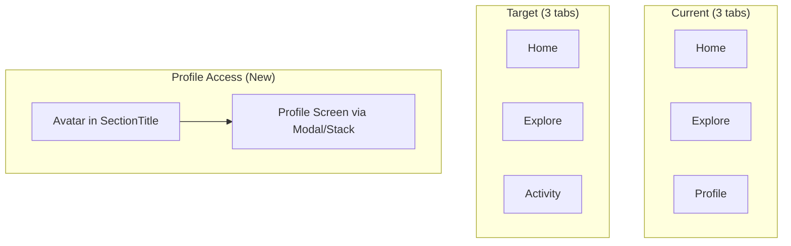
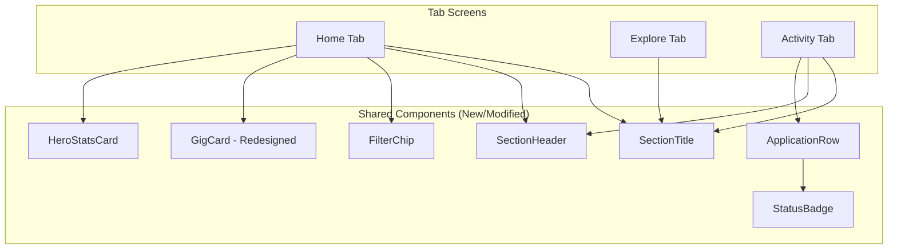
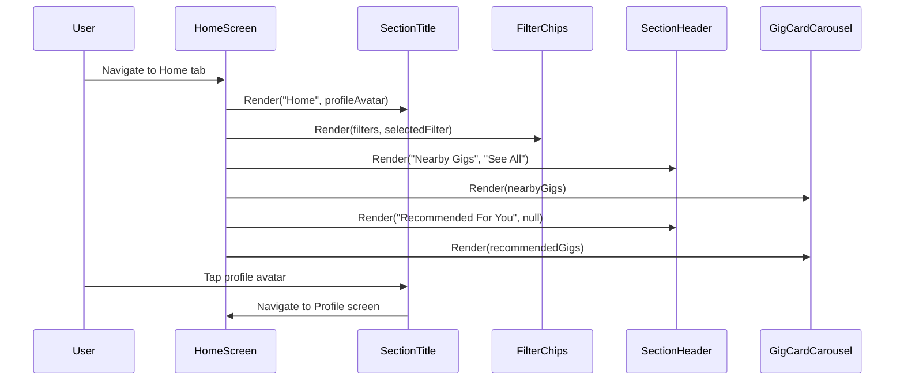
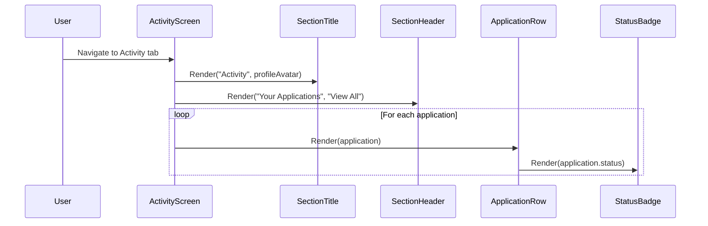

# Design Document: SwiftUI Alignment

## Overview

This feature aligns the existing React Native/Expo app views with the SwiftUI reference implementation in `swift-example/gigme/`. The primary changes are: replacing the Profile tab with an Activity tab, moving profile access to a header avatar, redesigning the Home view with filter chips and richer gig cards, and introducing new shared components (`SectionTitle`, `SectionHeader`, `FilterChip`, `GigCard` redesign, `ApplicationRow`, `StatusBadge`, `HeroStatsCard`).

The SwiftUI reference defines a cleaner, more visual layout emphasising discovery (horizontal gig carousels with image cards) and application tracking (vertical list with status badges). The React Native implementation currently uses a simpler text-only card design and places profile as a dedicated tab. This alignment brings the RN app to visual and structural parity with the SwiftUI prototype while preserving the existing data layer, role-switching logic, and Expo Router architecture.

## Architecture

### Navigation Structure Change



### Component Architecture



### Sequence Diagram: Home View Rendering



### Sequence Diagram: Activity Tab



## Components and Interfaces

### SectionTitle

**Purpose**: Large bold section heading with profile avatar button. Appears at the top of each tab screen. Replaces the need for a Profile tab by providing avatar-based navigation to the profile screen.

**Interface**:
```typescript
interface SectionTitleProps {
  sectionName: string;
  onProfilePress: () => void;
}
```

**Responsibilities**:
- Render section name in large bold text (34pt equivalent, font weight 700)
- Render a circular profile avatar (40x40) on the trailing edge
- Avatar is pressable and navigates to the profile screen
- Horizontal padding of 20, top padding 8, bottom padding 4

**Visual Spec** (from SwiftUI `SectionTitles.swift`):
- HStack with center alignment
- Text: system size 34, bold weight, primary foreground color
- Image: 40x40, circle clipped, `person.circle.fill` system icon (use Ionicons equivalent)

---

### SectionHeader

**Purpose**: Section header with title and optional trailing action button. Used above carousels and list sections.

**Interface**:
```typescript
interface SectionHeaderProps {
  title: string;
  actionTitle?: string;
  onAction?: () => void;
}
```

**Responsibilities**:
- Render title in title3 weight (semibold, ~20px)
- Optionally render a trailing action button ("See All", "View All") in blue
- Horizontal padding matching SectionTitle

**Visual Spec** (from SwiftUI `SectionHeaders.swift`):
- HStack with Spacer between title and action
- Title: `.title3` font, `.semibold` weight
- Action button: `.subheadline` font, blue foreground

---

### FilterChip

**Purpose**: Capsule-shaped filter buttons for gig time-based filtering. Rendered in a horizontal scrollable row.

**Interface**:
```typescript
interface FilterChipProps {
  title: string;
  isSelected: boolean;
  onPress: () => void;
}
```

**Responsibilities**:
- Render text in subheadline size
- Selected state: white text on blue background, semibold weight
- Unselected state: primary text on systemGray6 background, regular weight
- Capsule shape (fully rounded corners)
- Horizontal padding 16, vertical padding 8

---

### GigCard (Redesigned)

**Purpose**: Richer visual gig card with image area, favorite button, venue info, date, payment, and genre chips. Replaces the current text-only card.

**Interface**:
```typescript
interface GigCardProps {
  gig: Gig;
  onPress: (gigId: string) => void;
  onFavorite?: (gigId: string) => void;
  isFavorited?: boolean;
}
```

**Responsibilities**:
- Fixed width of 280px
- Image area: 280×140px gradient placeholder (blue→purple, 0.3 opacity)
- Heart/favorite icon button: top-right of image, white icon, ultra-thin material circle background
- Venue name: headline font, 1 line limit
- Date: caption font, secondary color, calendar icon prefix
- Payment: caption font, green color, banknote icon prefix
- Genre chips: max 2 shown, caption2 font, capsule badges on systemGray6 background
- Card: rounded corners (12px), shadow (black 0.1, radius 8, y offset 4), system background color

**Visual Spec** (from SwiftUI `HomeView.swift` GigCard):
- VStack alignment leading, spacing 8
- Image area: Rectangle with LinearGradient fill, overlay heart button
- Heart button: `.ultraThinMaterial` background, circle clip, 8px padding
- Bottom section: 8px horizontal padding, 8px bottom padding

---

### ApplicationRow

**Purpose**: Displays a single gig application in the Activity tab with avatar, venue info, and status badge.

**Interface**:
```typescript
interface ApplicationRowProps {
  application: Application;
  onPress?: (applicationId: string) => void;
}
```

**Responsibilities**:
- Circular gradient avatar (50×50) with music note icon overlay
- Venue name: subheadline font, semibold
- Date: caption font, secondary color
- Trailing StatusBadge component
- Row background: systemGray6 equivalent, rounded corners 12px
- Inner padding on all sides
- Spacing 12 between avatar and text

---

### StatusBadge

**Purpose**: Capsule-shaped colored badge showing application status (Pending/Accepted/Declined).

**Interface**:
```typescript
interface StatusBadgeProps {
  status: ApplicationStatus;
}
```

**Responsibilities**:
- Text: caption2 font, semibold, white foreground
- Background color: orange (pending), green (accepted), red (declined)
- Capsule shape
- Horizontal padding 10, vertical padding 5

---

### HeroStatsCard

**Purpose**: Gradient summary card displaying key musician stats. Optional component for dashboard enhancement.

**Interface**:
```typescript
interface HeroStatsCardProps {
  stats: StatItem[];
}

interface StatItem {
  number: string;
  label: string;
  color: string;
}
```

**Responsibilities**:
- HStack with equal-width stat boxes
- Each box: number (title2 bold, colored), label (caption, secondary, centered)
- Card background: linear gradient (blue 0.1 → purple 0.1)
- Rounded rectangle clip (16px corners)
- Horizontal padding

## Data Models

### New Type: Application

```typescript
interface Application {
  id: string;
  venue: string;
  date: string;           // Display-formatted string (e.g., "Nov 14, 9:00 PM")
  status: ApplicationStatus;
  gigId?: string;         // Optional reference to source gig
}

type ApplicationStatus = 'pending' | 'accepted' | 'declined';
```

**Validation Rules**:
- `id` must be a non-empty unique string
- `venue` must be a non-empty string
- `date` must be a non-empty string
- `status` must be one of the three enum values

### New Type: GigFilter

```typescript
type GigFilter = 'all' | 'today' | 'thisWeek' | 'nextWeek';
```

### Extended Color Tokens (theme.ts additions)

```typescript
// New colors needed to support the SwiftUI alignment
export const SemanticColors = {
  favorite: '#FF3B30',        // Heart icon when favorited
  statusPending: '#FF9500',   // Orange
  statusAccepted: '#34C759',  // Green
  statusDeclined: '#FF3B30',  // Red
  paymentGreen: '#34C759',    // Payment text
  actionBlue: '#007AFF',      // Action buttons ("See All")
  gradientStart: 'rgba(0, 122, 255, 0.1)',  // Stats card gradient
  gradientEnd: 'rgba(175, 82, 222, 0.1)',   // Stats card gradient
  cardImageGradientStart: 'rgba(0, 122, 255, 0.3)',  // Card image gradient
  cardImageGradientEnd: 'rgba(175, 82, 222, 0.3)',   // Card image gradient
  ultraThinMaterial: 'rgba(255, 255, 255, 0.6)',     // Heart button bg
} as const;
```

### Mock Applications Data

```typescript
const MOCK_APPLICATIONS: Application[] = [
  { id: '1', venue: 'The Basement', date: 'Nov 14, 9:00 PM', status: 'pending' },
  { id: '2', venue: 'Jazz Corner', date: 'Nov 13, 8:00 PM', status: 'accepted' },
  { id: '3', venue: 'Open Mic Night', date: 'Nov 12, 7:30 PM', status: 'declined' },
];
```

## Algorithmic Pseudocode

### Filter Gigs Algorithm

```typescript
function filterGigsByTimeRange(gigs: Gig[], filter: GigFilter): Gig[] {
  // PRECONDITION: gigs is a valid array, filter is a valid GigFilter value
  // POSTCONDITION: returns subset of gigs matching the time criteria
  //   - 'all': returns all gigs unchanged
  //   - 'today': returns gigs with date === today
  //   - 'thisWeek': returns gigs with date in current week (Mon-Sun)
  //   - 'nextWeek': returns gigs with date in next week (Mon-Sun)
  // INVARIANT: returned array is always a subset of input (no new gigs created)

  const today = new Date();
  today.setHours(0, 0, 0, 0);

  switch (filter) {
    case 'all':
      return gigs;

    case 'today':
      return gigs.filter(g => {
        const gigDate = new Date(g.date + 'T00:00:00');
        return gigDate.getTime() === today.getTime();
      });

    case 'thisWeek': {
      const startOfWeek = getStartOfWeek(today);
      const endOfWeek = new Date(startOfWeek);
      endOfWeek.setDate(endOfWeek.getDate() + 6);
      return gigs.filter(g => {
        const gigDate = new Date(g.date + 'T00:00:00');
        return gigDate >= startOfWeek && gigDate <= endOfWeek;
      });
    }

    case 'nextWeek': {
      const nextWeekStart = getStartOfWeek(today);
      nextWeekStart.setDate(nextWeekStart.getDate() + 7);
      const nextWeekEnd = new Date(nextWeekStart);
      nextWeekEnd.setDate(nextWeekEnd.getDate() + 6);
      return gigs.filter(g => {
        const gigDate = new Date(g.date + 'T00:00:00');
        return gigDate >= nextWeekStart && gigDate <= nextWeekEnd;
      });
    }
  }
}
```

### Status Badge Color Resolution

```typescript
function getStatusColor(status: ApplicationStatus): string {
  // PRECONDITION: status is a valid ApplicationStatus enum value
  // POSTCONDITION: returns a hex color string corresponding to the status
  //   - pending → orange (#FF9500)
  //   - accepted → green (#34C759)
  //   - declined → red (#FF3B30)
  // INVARIANT: always returns a valid color, never undefined

  const colorMap: Record<ApplicationStatus, string> = {
    pending: SemanticColors.statusPending,
    accepted: SemanticColors.statusAccepted,
    declined: SemanticColors.statusDeclined,
  };
  return colorMap[status];
}
```

## Key Functions with Formal Specifications

### Function: filterGigsByTimeRange

```typescript
function filterGigsByTimeRange(gigs: Gig[], filter: GigFilter): Gig[]
```

**Preconditions:**
- `gigs` is a valid array (may be empty)
- `filter` is one of: 'all', 'today', 'thisWeek', 'nextWeek'

**Postconditions:**
- Returns an array that is a subset of `gigs`
- When filter is 'all', returns the full input array
- When filter is 'today', every returned gig has date === today's date
- When filter is 'thisWeek', every returned gig has date within Mon–Sun of current week
- When filter is 'nextWeek', every returned gig has date within Mon–Sun of next week
- No gig in the result has a date outside the specified range
- Order is preserved from input

**Loop Invariants:**
- Each iteration of filter checks exactly one gig's date
- Previously checked gigs remain in/out of result unchanged

---

### Function: getStartOfWeek

```typescript
function getStartOfWeek(date: Date): Date
```

**Preconditions:**
- `date` is a valid Date object

**Postconditions:**
- Returns a Date representing Monday 00:00:00 of the week containing `date`
- The returned date is always <= `date`
- The returned date's day of week is Monday (1)

---

### Function: getStatusColor

```typescript
function getStatusColor(status: ApplicationStatus): string
```

**Preconditions:**
- `status` is 'pending', 'accepted', or 'declined'

**Postconditions:**
- Returns a non-empty hex color string
- Mapping is deterministic: same status always returns same color

---

### Function: truncateGenres

```typescript
function truncateGenres(genres: string[], max: number): string[]
```

**Preconditions:**
- `genres` is a valid string array
- `max` is a positive integer

**Postconditions:**
- Returns at most `max` items from the start of `genres`
- If `genres.length <= max`, returns the full array
- Order is preserved

## Example Usage

```typescript
// SectionTitle usage in a tab screen
import { SectionTitle } from '@/components/SectionTitle';
import { useRouter } from 'expo-router';

function HomeScreen() {
  const router = useRouter();

  return (
    <SafeAreaView>
      <SectionTitle
        sectionName="Home"
        onProfilePress={() => router.push('/profile')}
      />
      {/* ... rest of home content */}
    </SafeAreaView>
  );
}

// FilterChips horizontal scroll
<ScrollView horizontal showsHorizontalScrollIndicator={false}>
  <View style={styles.chipRow}>
    {filters.map(filter => (
      <FilterChip
        key={filter}
        title={filterLabels[filter]}
        isSelected={selectedFilter === filter}
        onPress={() => setSelectedFilter(filter)}
      />
    ))}
  </View>
</ScrollView>

// GigCard in carousel
<FlatList
  horizontal
  data={nearbyGigs}
  renderItem={({ item }) => (
    <GigCard
      gig={item}
      onPress={(id) => router.push(`/gig/${id}`)}
      onFavorite={(id) => toggleFavorite(id)}
    />
  )}
/>

// ApplicationRow in Activity tab
<View>
  {applications.map(app => (
    <ApplicationRow key={app.id} application={app} />
  ))}
</View>

// HeroStatsCard
<HeroStatsCard
  stats={[
    { number: '23', label: 'Active Gigs', color: SemanticColors.actionBlue },
    { number: '5', label: 'Applications', color: SemanticColors.statusPending },
    { number: '12', label: 'This Week', color: SemanticColors.statusAccepted },
  ]}
/>
```

## Correctness Properties

*A property is a characteristic or behavior that should hold true across all valid executions of a system — essentially, a formal statement about what the system should do. Properties serve as the bridge between human-readable specifications and machine-verifiable correctness guarantees.*

### Property 1: Filter subset invariant

*For any* array of gigs and any valid GigFilter value, `filterGigsByTimeRange(gigs, filter)` shall return an array that is a subset of the input array — no element in the output shall be absent from the input, and the output length shall never exceed the input length.

**Validates: Requirements 8.5**

### Property 2: Filter 'all' identity

*For any* array of gigs, `filterGigsByTimeRange(gigs, 'all')` shall return an array with the same length and same elements as the input.

**Validates: Requirements 8.1**

### Property 3: Filter date correctness

*For any* array of gigs and any non-'all' GigFilter value, every gig in the result of `filterGigsByTimeRange(gigs, filter)` shall have a date field that falls within the time range specified by that filter ('today' = today's date, 'thisWeek' = current Mon–Sun, 'nextWeek' = next Mon–Sun).

**Validates: Requirements 8.2, 8.3, 8.4**

### Property 4: Filter order preservation

*For any* array of gigs and any valid GigFilter value, the relative order of elements in the output of `filterGigsByTimeRange(gigs, filter)` shall match their relative order in the input array.

**Validates: Requirements 8.6**

### Property 5: Status color totality and correctness

*For any* valid ApplicationStatus value, `getStatusColor(status)` shall return the correct non-empty hex color string: 'pending' → #FF9500, 'accepted' → #34C759, 'declined' → #FF3B30. The function is total over its domain (no undefined returns).

**Validates: Requirements 11.2, 11.3, 11.4, 11.6**

### Property 6: Genre truncation bound and order

*For any* genres array and positive integer max, `truncateGenres(genres, max)` shall return at most `max` items, taken from the start of the input array in their original order. If the input length is ≤ max, the output shall equal the input unchanged.

**Validates: Requirements 15.1, 15.2, 15.3, 7.8**

### Property 7: Application list ordering preservation

*For any* array of applications rendered in the Activity tab, the rendered ApplicationRow components shall appear in the same order as the input array — no reordering shall occur.

**Validates: Requirements 9.3, 9.4**

## Error Handling

### Error Scenario 1: Empty Gig Data

**Condition**: No gigs available for a given filter
**Response**: Carousel renders an EmptyState component with contextual message
**Recovery**: User can select a different filter or wait for new data

### Error Scenario 2: Invalid Application Status

**Condition**: An application has an unexpected status value
**Response**: StatusBadge falls back to a neutral gray color and displays the raw status text
**Recovery**: No user action needed; defensive rendering prevents crash

### Error Scenario 3: Profile Navigation Failure

**Condition**: Profile screen route not available (shouldn't happen, but defensive)
**Response**: Avatar press is a no-op rather than crashing
**Recovery**: User can access profile through other means if available

### Error Scenario 4: Missing Genre Data

**Condition**: Gig has empty or undefined genres array
**Response**: GigCard renders without genre chips section (no crash)
**Recovery**: No action needed

## Testing Strategy

### Unit Testing Approach

- Test `filterGigsByTimeRange` with various dates and filter combinations
- Test `getStatusColor` returns correct color for each status
- Test `truncateGenres` correctly limits output
- Test component rendering: SectionTitle shows name + avatar, SectionHeader shows title + action, FilterChip shows selected/unselected states
- Test GigCard renders all expected elements (image area, venue, date, payment, genres)
- Test ApplicationRow renders avatar, venue, date, and StatusBadge
- Test tab layout renders exactly 3 tabs with correct labels

### Property-Based Testing Approach

**Property Test Library**: fast-check

Properties 1–8 from the Correctness Properties section will be implemented as property-based tests targeting:
- `filterGigsByTimeRange` (Properties 1, 2, 3)
- `getStatusColor` (Property 4)
- `truncateGenres` (Property 5)
- Array ordering (Property 6)

**Generators needed**:
- `arbGig`: Random valid Gig objects with dates spanning past, present, and future
- `arbGigFilter`: One of 'all' | 'today' | 'thisWeek' | 'nextWeek'
- `arbApplicationStatus`: One of 'pending' | 'accepted' | 'declined'
- `arbGenreArray`: Random array of 0–10 genre strings
- `arbApplication`: Random valid Application objects

### Integration Testing Approach

- Verify tab navigation switches between Home, Explore, Activity correctly
- Verify SectionTitle avatar navigates to profile screen
- Verify filter chip selection updates the visible gig list
- Verify Activity tab renders applications from context

## Performance Considerations

- GigCard image placeholder uses a simple LinearGradient — no heavy image loading
- FlatList with `horizontal` prop uses native recycling — efficient for carousels
- Filter computation is O(n) per filter change — acceptable for mock data sizes
- ApplicationRow list uses map (not FlatList) since expected count is small (<20)
- Memoize filtered gig arrays with `useMemo` keyed on filter + gig list reference

## Security Considerations

- Profile navigation via avatar doesn't expose any new data; it's the same screen moved to a different access point
- Application status is read-only from mock data; no mutation surface
- No new network calls or external data sources introduced

## Dependencies

- **Existing** (no new packages required):
  - `expo-router` — navigation and routing
  - `expo-symbols` — SF Symbols for tab icons
  - `react-native-safe-area-context` — safe area handling
  - `react-native` — core components (View, Text, FlatList, ScrollView, Pressable)
  - `expo-linear-gradient` — gradient fills for card images and stats card (already available via Expo)
  
- **Potentially needed**:
  - `expo-linear-gradient` — if not already installed, needed for GigCard image placeholder and HeroStatsCard background. Check `package.json` first; Expo SDK 57 may include it.
  - `@expo/vector-icons` — for calendar, banknote, heart, music.note icons (Ionicons subset). Already available in Expo projects by default.

## File Changes Summary

### New Files
| File | Purpose |
|------|---------|
| `src/components/SectionTitle.tsx` | Large title + profile avatar |
| `src/components/SectionHeader.tsx` | Section heading + action button |
| `src/components/FilterChip.tsx` | Capsule filter button |
| `src/components/ApplicationRow.tsx` | Activity list row item |
| `src/components/StatusBadge.tsx` | Colored status capsule |
| `src/components/HeroStatsCard.tsx` | Gradient stats summary card |
| `src/app/(tabs)/activity.tsx` | Activity tab screen |
| `src/data/mockApplications.ts` | Sample application data |

### Modified Files
| File | Change |
|------|--------|
| `src/app/(tabs)/_layout.tsx` | Replace Profile tab with Activity tab |
| `src/app/(tabs)/index.tsx` | Redesign Home with SectionTitle, FilterChips, SectionHeader, new GigCard |
| `src/app/(tabs)/explore.tsx` | Add SectionTitle header |
| `src/components/GigCard.tsx` | Complete redesign: image area, favorite, icons, genre chips |
| `src/constants/theme.ts` | Add SemanticColors, adjust spacing tokens as needed |
| `src/types/index.ts` | Add Application, ApplicationStatus, GigFilter types |
| `src/data/gigService.ts` | Add filterGigsByTimeRange, getStartOfWeek, truncateGenres |

### Removed/Repurposed Files
| File | Change |
|------|--------|
| `src/app/(tabs)/profile.tsx` | Remove from tabs (profile becomes a stack screen accessible via avatar) |
